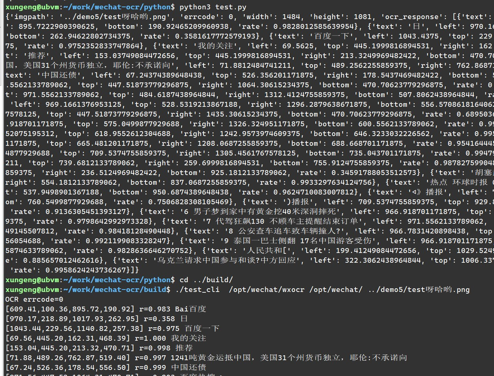

# wcocr: demonstrate how to use WeChatOCR.exe

Great thanks to IEEE by his [Project IEEE/QQImpl](https://github.com/EEEEhex/qqimpl)] and [article](https://bbs.kanxue.com/thread-278161.htm).
This project is based on it and reduced the product size by using `protobuf-lite` instead of `protobuf`.

This project provided a direct Python interface for calling in sync mode as well as other languages support including but not limited with c++/java/c#.

# Prepare for usage

To work with this project, you need to prepare the wechat OCR binary and the wechat runtime folder.

For wechat 3.x, the wechat OCR binary is `wechatocr.exe`, it might be:

```
C:\Users\yourname\AppData\Roaming\Tencent\WeChat\XPlugin\Plugins\WeChatOCR\7061\extracted\WeChatOCR.exe
```
and the wechat runtime folder might be:
```
C:\Program Files (x86)\Tencent\WeChat\[3.9.8.25]
```

**Wechat 4.0 is now supported!**

For wechat 4.0, the wechat OCR binary is `wxocr.dll`, it might be:

```
C:\Users\yourname\AppData\Roaming\Tencent\xwechat\XPlugin\plugins\WeChatOcr\8011\extracted\wxocr.dll
```

and the wechat runtime folder might be:

```
C:\Program Files\Tencent\Weixin\4.0.0.26
```

## Warning

WeChat 4.0 OCR binary is `wxocr.dll`, but this project built a DLL named `wcocr.dll`

**Their names are similar, DO NOT confuse them.**


# Linux is now supported



Typically, You should use `/opt/wechat/wxocr` as the OCR exe path and `/opt/wechat/` as the WeChat folder path.

The other usages are similar to those on Windows.

## C++ interface

You can use the following code to test it:
```cpp
CWeChatOCR ocr(wechatocr_path, wechat_path);
if (!ocr.wait_connection(5000)) {
	// error handling
}
CWeChatOCR::result_t result;
ocr.doOCR("D:\\test.png", &result);
```
You can also pass `nullptr` to the second parameter of `doOCR` to call in async mode and wait the callback.
In this case, you need to subclass `CWeChatOCR` and implement the virtual function `OnOCRResult`.

## Python interface
Rename the built `wcocr.dll` to `wcocr.pyd` and put it in the same directory as `test.py`.
You can use the following code to test it:

```python
import wcocr
wcocr.init(wechatocr_path, wechat_path)
result = wcocr.ocr("D:\\test.png")
```

Currently, the python interface only supports sync mode.

## Java interface

* see java/Test.java
* I'm not so familiar with java and don't know how to pass complex data structures, so I just passed a JSON string from cpp to java.
* The added DLL export function `wechat_ocr` can also be used in other scenarios.

## C Sharp (C#) interface
* see `c_sharp` folder.
* It's important to ensure the built dll is copied to the folder test_cs.exe in! always copy the 64bit version dll!
* It's ok to built a 32bit test_cs.exe and copy the 32bit dll, you can try.
